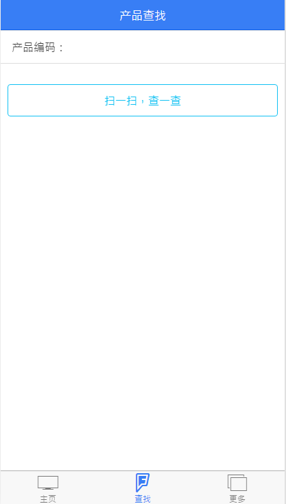
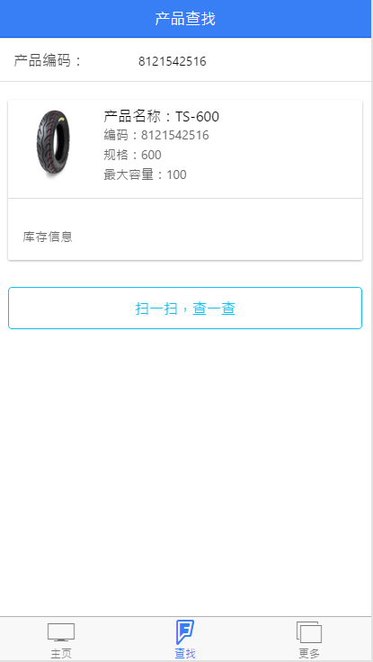
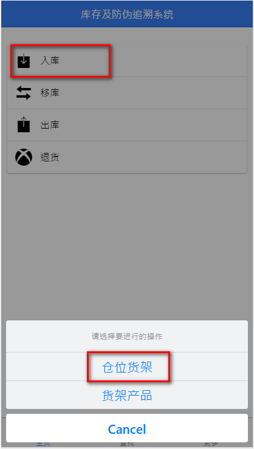
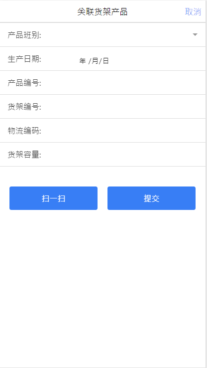

# FollowMe物流追溯系统-简化版demo-移动端

# 相关工具

- 包管理：npm
- 框架：
  + 移动端 -- ionic、cordova、ngCordova
  + PC端   -- mysql、express、angular、nodejs、

# 业务简介

- 业务流程；
	1.加工车间生产完成的轮胎，用货架（不同规格的轮胎，一架能容纳的数量不同）送至包装车间的待包装区；包装课长根据订单和发货安排，进行包装排班（实际流程中，同一轮胎针对客户区分包装，此处简化处理）
	2.包装过程，先用打包带包装每一条胎，5条胎塑封为一捆（不同客户塑封需求不同，有的要求10条一捆，有的客户不需要打捆），放到另外的货架上，不同规格的轮胎，货架能存放的上限不同，需要单独设置，
	3.包装时每一条胎的外包装贴一个条码，每5条打一捆，粘贴一个捆标签，捆条码和单条的条码是预先生成并绑定好的，货架存放多捆轮胎

# 程序基本功能：

  + 产品查找

  + 库存管理
    - 入库
      + 货架产品
      + 仓位货架
    - 出库
      + 有单出库
      + 单据下载
    - 移库
      + 移动产品
      + 移动货架
      + 移动仓位
    - 退货

  + 其他功能
    - 修改密码
    - 数据更新
    - 上传日志

Tips：
作为demo，仅实现了扫描产品编码，显示产品详情功能；

入库部分，仅制作了产品货架的关联页，可以扫描条码，自动区分数据并录入表单，服务器端未实现保存入库单功能

# 编码规则 

- 产品编码：以ERP产品编号为准（8位以上的数字 以789开头）
- 条码编码：按照1:5的对应关系提前生成（1捆：5条，捆码以5开头，10位数字）
- 仓位编码：第一位仓库编号，第二位区域编号，第三和第四位仓位编号 例如：3A01-3A17 3E01-3E17
- 货架编码：0001-6000的流水编号

# 数据结构 见myBack

# Have a try

apk文件存放位置：myApp\platforms\android\build\outputs\apk\android-debug.apk
目前app程序中，配置的服务器地址是 http://192.168.1.6:3000，请将你的服务器地址修改为 192.168.1.6；并保证手机和服务器处于一个网络中

如果仅在浏览器端访问，修改 myApp\www\js\global.js 文件，将 http://192.168.1.6 修改为 localhost 或者 127.0.0.1，然后通过http的方式访问 myApp\www\idnex.html
